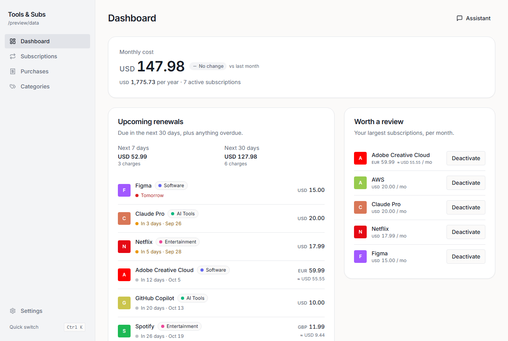
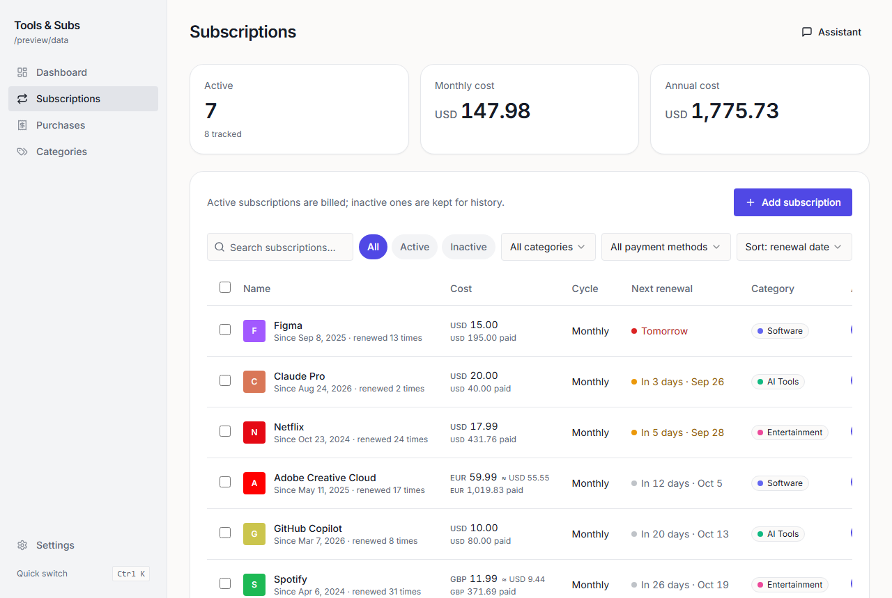
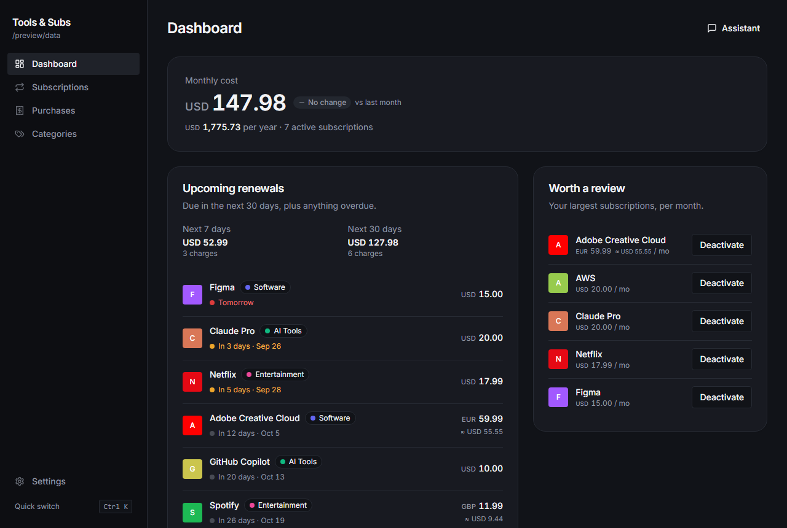
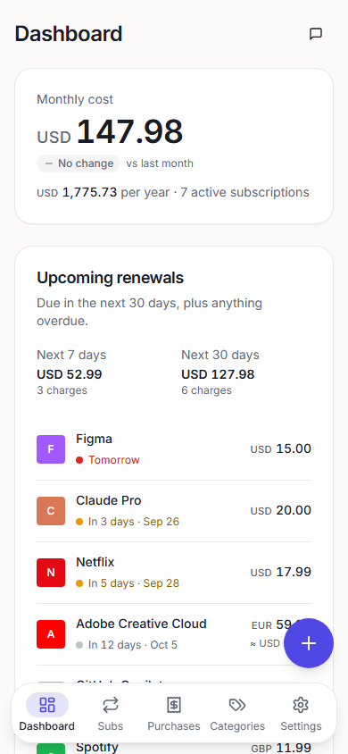

# Tools & Subs Manager

Track the software, subscriptions, and one-time purchases you pay for.
See what you spend each month and year, what renews next, and what you
could cancel.

It runs as a **local desktop app** (Windows, macOS) with no account and no
cloud, or as a **self-hosted web app** you can install on your phone. Both
are built from the same code.

| Dashboard | Subscriptions |
| --- | --- |
|  |  |

| Dark mode | Mobile |
| --- | --- |
|  |  |

---

## Contents

- [Features](#features)
- [Desktop or web?](#desktop-or-web)
- [Install the desktop app](#install-the-desktop-app)
- [Self-hosting the web app](#self-hosting-the-web-app)
  - [1. Set up Supabase](#1-set-up-supabase)
  - [2a. Deploy with Docker](#2a-deploy-with-docker)
  - [2b. Deploy with Coolify](#2b-deploy-with-coolify)
  - [3. Check it works](#3-check-it-works)
- [Configuration reference](#configuration-reference)
- [Optional features](#optional-features)
- [Development](#development)
- [Privacy](#privacy)
- [Troubleshooting](#troubleshooting)
- [Contributing, security, license](#contributing-security-license)

---

## Features

- **Subscriptions**: cost, currency, billing cycle (monthly, quarterly,
  yearly, custom), next renewal, free trials, price history, payment
  method, cancellation link, and per-item reminder settings.
- **One-time purchases**: lifetime licenses, hardware, courses, and so on,
  with categories.
- **Dashboard** built around three questions:
  1. *What do I pay?* Monthly total, annual total, and the trend.
  2. *What renews next?* Upcoming and overdue renewals.
  3. *What could I cancel?* Your most expensive subscriptions, with their
     cancellation links.
- **Reminders** before renewals and trial ends, with quiet hours:
  desktop notifications, or Web Push on the web app.
- **Multi-currency**: each item keeps its own currency, and every total
  is converted to your default currency using weekly ECB rates from
  [Frankfurter](https://frankfurter.dev).
- **Categories and budgets**, search, filters, and bulk actions.
- **Import and export**: CSV and JSON, plus an `.ics` renewal calendar.
- **Command palette**: `Ctrl/⌘ + K`.
- **Light and dark themes** and a custom accent color.
- **Desktop extras**: runs in the system tray and makes a daily automatic
  backup.
- **Optional AI assistant**: bring your own [OpenRouter](https://openrouter.ai)
  key and ask questions about your spending. Any change it proposes needs
  your approval.

## Desktop or web?

| | Desktop | Web (self-hosted) |
| --- | --- | --- |
| Where data lives | A JSON file in a folder you choose | Your own Supabase Postgres database |
| Account | None | Email and password |
| Sync across devices | No (you can put the folder in a synced drive) | Yes |
| Phone | No | Yes, installable as a PWA |
| Reminders | OS notifications (app must be running, in the tray is enough) | Web Push, even when the app is closed |
| Setup effort | `npm install && npm run dev` | Supabase project + a Docker host |

If you just want to track your own subscriptions on one computer, use the
desktop app.

---

## Install the desktop app

### Download (recommended)

Get the latest installer from the
**[Releases page](https://github.com/devhuzi/subs-manager/releases/latest)**:

| System | File |
| --- | --- |
| Windows 10/11 (64-bit) | `Tools-and-Subs-Manager-Setup-<version>.exe` |
| macOS, Apple Silicon (M1 and later) | `Tools-and-Subs-Manager-<version>-arm64.dmg` |
| macOS, Intel | `Tools-and-Subs-Manager-<version>-x64.dmg` |

- **Windows**: run the `.exe` and follow the installer. You can choose the
  install folder. Uninstall it from **Settings → Apps**.
- **macOS**: open the `.dmg` and drag the app into **Applications**.

The desktop app needs no account, no Supabase, and no configuration. Your
data stays on your computer.

> **Unsigned builds.** The installers aren't code-signed.
> - **Windows** SmartScreen will say "Windows protected your PC". Click
>   **More info → Run anyway**.
> - **macOS** will say the app "can't be opened". Right-click the app, choose
>   **Open**, then click **Open** again. On newer macOS versions, go to
>   **System Settings → Privacy & Security → Open Anyway** instead.

### Build from source

#### Requirements

- [Node.js](https://nodejs.org) **20 or newer** (includes npm)
- [Git](https://git-scm.com)
- About 1 GB of free disk space for dependencies

#### Run it

```bash
git clone https://github.com/devhuzi/subs-manager.git
cd subs-manager
npm install
npm run dev
```

The app window opens. No configuration or `.env` file is needed for the
desktop app.

#### Build your own installer

```bash
npm run package
```

Output goes to `release/`: `Tools-and-Subs-Manager-Setup-<version>.exe`
on Windows, or the `.dmg` files on macOS. Build on the operating system
you are targeting.

**Maintainers:** push a tag such as `v0.2.0`. The
[Release workflow](.github/workflows/release.yml) then builds the Windows
and macOS installers and attaches them to a GitHub Release.

### Where your data is stored

By default the data is in the app-data folder inside a `data` subfolder:

- Windows: `%APPDATA%\Tools & Subs Manager\data`
- macOS: `~/Library/Application Support/Tools & Subs Manager/data`

You can move it anywhere under **Settings → Data location**. Backups are written to
`<data folder>/backups/`: one per day, plus any you make with **Back up
now**. To restore, use **Settings → Backup & migration → Restore from JSON** and pick a backup file.

---

## Self-hosting the web app

The web app has two parts:

1. **Supabase** holds the database, logins, and a few server functions
   (reminders, AI proxy, logo fetching). The free tier is enough for
   personal use.
2. **A static frontend**, served by nginx in a Docker container, on any
   server or on [Coolify](https://coolify.io).

Plan on about 30 minutes the first time.

### Requirements

- A [Supabase](https://supabase.com) account (free tier works)
- The [Supabase CLI](https://supabase.com/docs/guides/local-development/cli/getting-started)
- Node.js 20+ and Git, on the machine you run the setup from
- A Docker host or a Coolify server, and a domain (HTTPS is required for
  PWA install and push notifications)

### 1. Set up Supabase

**1.1 Create a project.** In the Supabase dashboard, click **New project**.
Choose a region and a strong database password. When it's ready, open
**Project Settings → API** and note:

- **Project URL**: `https://<project-ref>.supabase.co`
- **Project ref**: the `<project-ref>` part of that URL
- **anon / publishable key**: this key is public by design. Row-level
  security protects the data.

Never put the **service_role** key in the frontend or in any file in this
repo.

**1.2 Create the database.** From the repo folder:

```bash
npx supabase login
npx supabase link --project-ref <project-ref>
npx supabase db push
```

This creates the tables, row-level security, Vault helpers, rate limits,
and the reminder cron job.

**1.3 Tell the reminder job where your project is.** In the Supabase
dashboard, open the **SQL Editor** and run:

```sql
select vault.create_secret(
  'https://<project-ref>.supabase.co',   -- no trailing slash
  'project_url',
  'Base URL the scheduled-notify cron posts to'
);
```

**1.4 Generate Web Push keys.** These power reminders on phones:

```bash
npx web-push generate-vapid-keys
```

Keep both halves. The **public** key is used in two places (below). The
**private** key is a secret and goes only into Supabase.

**1.5 Set the server secrets.** Replace `https://subs.example.com` with the
domain you will serve the app from:

```bash
npx supabase secrets set \
  ALLOWED_ORIGINS=https://subs.example.com \
  VAPID_PUBLIC_KEY=<public key> \
  VAPID_PRIVATE_KEY=<private key> \
  VAPID_SUBJECT=mailto:you@example.com
```

`ALLOWED_ORIGINS` is required. Without it, the server functions only
accept requests from `localhost`. For more than one domain, separate
them with commas.

**1.6 Deploy the server functions:**

```bash
npx supabase functions deploy ai-chat ai-set-key ai-has-key ai-clear-key \
  fetch-logo delete-account scheduled-notify --no-verify-jwt
```

`--no-verify-jwt` is expected: each function checks the caller itself.

**1.7 Configure sign-in.** In the dashboard, go to **Authentication → URL
Configuration**:

- **Site URL**: `https://subs.example.com`
- **Redirect URLs**: add `https://subs.example.com`, which is used by
  password-reset emails

Under **Authentication → Providers → Email**, decide whether new users must
confirm their email. Confirmation needs working email delivery; Supabase's
built-in sender is heavily rate-limited, so for anything beyond personal use
set up custom SMTP under **Authentication → Emails**. If only you will use
the app, sign up once and then disable new signups.

More detail on each step: [`supabase/README.md`](supabase/README.md).

### 2a. Deploy with Docker

The `Dockerfile` builds the frontend and serves it with nginx on port 80.
The `VITE_*` values are compiled into the frontend, so pass them as **build
arguments**:

```bash
docker build -t subs-manager \
  --build-arg VITE_SUPABASE_URL=https://<project-ref>.supabase.co \
  --build-arg VITE_SUPABASE_ANON_KEY=<anon key> \
  --build-arg VITE_VAPID_PUBLIC_KEY=<vapid public key> \
  .

docker run -d --name subs-manager -p 8080:80 --restart unless-stopped subs-manager
```

The app is now on `http://<server>:8080`. Put it behind a reverse proxy
with HTTPS, for example Caddy, Traefik, or nginx with Let's Encrypt, and
serve it at the domain from step 1.5.

<details>
<summary>docker compose</summary>

```yaml
services:
  web:
    build:
      context: .
      args:
        VITE_SUPABASE_URL: https://<project-ref>.supabase.co
        VITE_SUPABASE_ANON_KEY: <anon key>
        VITE_VAPID_PUBLIC_KEY: <vapid public key>
        # VITE_PRIVACY_URL: https://subs.example.com/privacy
        # VITE_TERMS_URL: https://subs.example.com/terms
    ports:
      - "8080:80"
    restart: unless-stopped
```

</details>

If you change a `VITE_*` value, **rebuild** the image. Restarting the
container is not enough.

### 2b. Deploy with Coolify

1. Push this repo to your own GitHub account, as a fork or a copy.
2. In Coolify: **Projects → your project → + New → Resource → Public
   Repository**, or **Private Repository (GitHub App)** if your copy is
   private. Paste the repo URL and choose the branch.
3. **Build Pack**: choose **Dockerfile**. Leave **Base Directory** as `/`
   and set **Ports Exposes** to `80`.
4. **Domains**: enter `https://subs.example.com`. Coolify's proxy issues
   the HTTPS certificate automatically once DNS points at the server.
5. **Environment Variables**: add these and tick **Build Variable** on each
   one. They're needed at build time, not runtime:

   | Name | Value |
   | --- | --- |
   | `VITE_SUPABASE_URL` | `https://<project-ref>.supabase.co` |
   | `VITE_SUPABASE_ANON_KEY` | your anon/publishable key |
   | `VITE_VAPID_PUBLIC_KEY` | your VAPID public key |
   | `VITE_PRIVACY_URL` *(optional)* | link to your privacy policy |
   | `VITE_TERMS_URL` *(optional)* | link to your terms |

6. Click **Deploy**. Later pushes to the branch redeploy automatically if
   you enable **Auto Deploy** (on by default for GitHub App sources).

Make sure the domain in step 4 matches `ALLOWED_ORIGINS` (step 1.5) and the
Supabase **Site URL** (step 1.7) exactly, including `https://` and without
a trailing slash.

### 3. Check it works

1. Open your domain and sign up. You should land on an empty dashboard.
2. Add a subscription and reload the page. It should still be there.
3. On a phone, open the site and use **Add to Home Screen** to install it.
   Then turn on notifications in **Settings → Notifications**.
4. In **Settings → Notifications**, **Check renewals now** sends a test reminder if
   anything is due.

If sign-in or saving fails, see [Troubleshooting](#troubleshooting).

---

## Configuration reference

### Frontend (build-time, public)

Set these in `.env` for local development (copy `.env.example`), or as
Docker build args or Coolify build variables for production. They end up
in the JavaScript bundle, so never put a secret in a `VITE_` variable.

| Variable | Required | Purpose |
| --- | --- | --- |
| `VITE_SUPABASE_URL` | yes | Your Supabase project URL |
| `VITE_SUPABASE_ANON_KEY` | yes | Supabase anon/publishable key |
| `VITE_VAPID_PUBLIC_KEY` | for push | Public half of your VAPID key pair |
| `VITE_PRIVACY_URL` | no | Privacy-policy link on the sign-in and Settings screens |
| `VITE_TERMS_URL` | no | Terms link on the sign-in and Settings screens |

### Server (Supabase function secrets)

Set with `npx supabase secrets set NAME=value`. Never commit these.

| Secret | Required | Purpose |
| --- | --- | --- |
| `ALLOWED_ORIGINS` | yes | Comma-separated origins allowed to call the functions (CORS) |
| `VAPID_PUBLIC_KEY` | for push | Same public key as the frontend |
| `VAPID_PRIVATE_KEY` | for push | Signs push messages |
| `VAPID_SUBJECT` | for push | `mailto:` contact address for push services |
| `OPENROUTER_REFERER` | no | Sends your site URL to OpenRouter for attribution |

`SUPABASE_URL`, `SUPABASE_ANON_KEY`, and `SUPABASE_SERVICE_ROLE_KEY` are
provided to functions automatically.

### Vault secrets (in the database)

| Name | Created by | Purpose |
| --- | --- | --- |
| `cron_secret` | migration (random) | Authenticates the reminder cron job |
| `project_url` | you (step 1.3) | Where the cron job sends its request |

### Using a custom Supabase domain or self-hosted Supabase

The web build's Content Security Policy only allows connections to
`*.supabase.co`. If your Supabase API is on another domain, add it to
`connect-src` in [`docker/security-headers.conf`](docker/security-headers.conf),
as both `https://` and `wss://`, and rebuild the image.

---

## Optional features

These are all **off by default**. Turn them on in **Settings**.

| Feature | What leaves your machine | Notes |
| --- | --- | --- |
| Currency conversion | Currency codes, sent to `api.frankfurter.dev` | Rates are cached for a week (desktop) |
| Service logos | The service's domain, sent to DuckDuckGo's or Google's favicon service | Only the icon image is stored |
| AI assistant | Your question plus the parts of your data it reads, sent to OpenRouter and your chosen model | You supply your own OpenRouter key |

**About the AI key.** On desktop the key is encrypted with your operating
system's keychain through Electron `safeStorage`. On the web it goes into
Supabase Vault and only the server functions can read it. In both cases
the key never reaches the page's JavaScript, and it is never included in
exports.

---

## Development

```bash
npm install
npm run dev          # desktop app with hot reload
npm run dev:web      # web app at http://localhost:5173 (needs .env; see .env.example)

npm test             # unit tests (Vitest)
npm run test:e2e     # UI tests (Playwright, mocked backend, no Supabase needed)
                     #   first run: npx playwright install chromium
npm run typecheck
npm run lint
npm run format

npm run build        # desktop production build
npm run build:web    # web production build → dist/web
npm run package      # desktop installers → release/
```

### Project layout

```
src/main        Electron main process: file storage, backups, tray, reminders, FX, logos, AI proxy
src/preload     Typed bridge that exposes window.api to the UI
src/renderer    React UI shared by desktop and web
src/shared      Types, Zod schemas, date/renewal/reminder logic
src/web         Web entry: Supabase-backed window.api, sign-in, PWA + push
supabase        Migrations (schema, RLS, Vault, cron) and Edge Functions
docker          nginx config and security headers for the web image
e2e             Playwright tests against a mock backend
```

The UI never talks to Electron or Supabase directly; it only uses
`window.api`, whose shape is defined as `IpcApi` in `src/shared/types.ts`.
Architecture notes are in [`CLAUDE.md`](CLAUDE.md) and the design system
is in [`DESIGN.md`](DESIGN.md).

---

## Privacy

- **Desktop**: everything stays on your computer. The app has no
  analytics, no telemetry, and no accounts. It only makes network
  requests for the optional features above.
- **Web**: your data lives in *your* Supabase project, and row-level
  security isolates each account. Deleting an account from **Settings**
  removes its data and stored AI key.

If you run a public instance for other people, you're responsible for
your own privacy policy and terms. Link them with `VITE_PRIVACY_URL` and
`VITE_TERMS_URL`.

---

## Troubleshooting

**"Failed to fetch" / CORS errors in the browser console.** `ALLOWED_ORIGINS`
doesn't exactly match the address in your browser. Fix it with
`npx supabase secrets set ALLOWED_ORIGINS=https://your.domain`. Functions
pick up the new value on their next request.

**Blank page after deploying.** A `VITE_*` build argument was missing when
the image was built. Check the build log, set the variables (as **Build
Variables** in Coolify), and rebuild.

**Password-reset email link goes to localhost.** Set the **Site URL** and
**Redirect URLs** in Supabase (step 1.7).

**No push notifications.**
- The site must use HTTPS.
- On iPhone, the app must be installed to the Home Screen first (iOS 16.4
  or later).
- `VITE_VAPID_PUBLIC_KEY` must match the `VAPID_PUBLIC_KEY` secret.
- Check the cron job with `select * from cron.job_run_details order by start_time desc limit 5;`
  in the SQL editor.

**Desktop: no reminders.** The app has to be running; closing the window
keeps it in the tray by default. Also check **Settings → Notifications** and
your operating system's notification settings.

**Desktop: "data file was corrupt".** The app kept the broken file as
`subs-manager.corrupt-<time>.json` and restored the newest good backup.
Nothing is deleted.

---

## Contributing, security, license

- Contributions are welcome. See [CONTRIBUTING.md](CONTRIBUTING.md).
- Report vulnerabilities privately. See [SECURITY.md](SECURITY.md).
- Released under the [MIT License](LICENSE).
